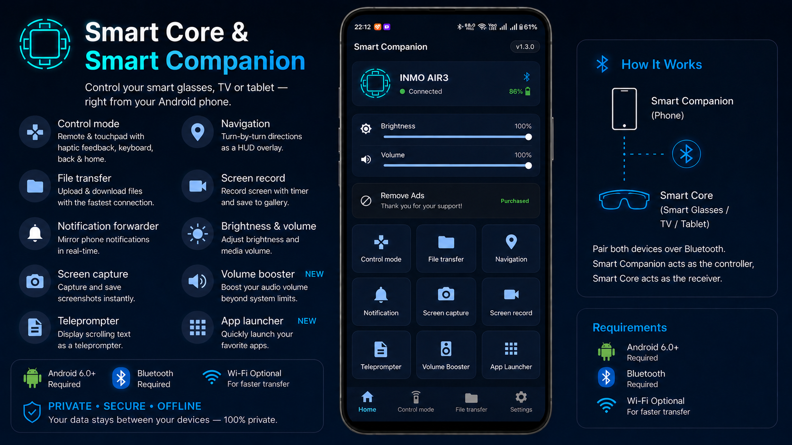

# Smart Core & Smart Companion



> **Control your smart glasses, TV or tablet — right from your Android phone.**

Smart Core and Smart Companion are a pair of Android apps that work together over Bluetooth to give you seamless control, notification mirroring, navigation HUD, screen capture, file transfer, and more — all from the comfort of your phone.

---

## 📦 Installations

| App / File                                                                                                                                                    | Install On                                                                          |
| ------------------------------------------------------------------------------------------------------------------------------------------------------- | ----------------------------------------------------------------------------------- |
| [`smart_core.apk`](https://raw.githubusercontent.com/vodacthe/smart_companion/refs/heads/main/releases/smart_core/latest/smart_core.apk)                | The **target device** you want to control (Smart Glasses, Android TV, tablet, etc.) |
| [**Smart Companion on Google Play**](https://play.google.com/store/apps/details?id=asia.bobgaming.smart_companion)<br>*(Or download the APK directly: [`smart_companion.apk`](https://raw.githubusercontent.com/vodacthe/smart_companion/refs/heads/main/releases/smart_companion/latest/smart_companion.apk))* | Your **Android phone** (the controller)                                             |

---

## 🔗 How It Works

```
  📱 Smart Companion (Phone)
          │
          │  Bluetooth
          │
  🥽 Smart Core (Smart Glasses / TV / Tablet)
```

Pair both devices over Bluetooth. Smart Companion acts as the **controller**, Smart Core acts as the **receiver**. Once connected, your phone becomes a full-featured remote for the target device.

---

## ✨ Features

### 🔔 Notification Forwarder

- Your phone's notifications appear instantly as cards on your smart glasses or TV screen.
- Dismissible cards — swipe away or tap to view full history.
- Adapts to both **portrait and landscape** orientations.
- Only meaningful notifications are shown — silent or empty ones are filtered out automatically.

### 🕹️ Control Mode (Remote & Touchpad)

- **Touchpad tab** — Use your phone screen as a large touchpad for cursor/pointer control with haptic feedback.
  - Left/right scroll bars for vertical scrolling.
  - Horizontal scroll bar for horizontal scrolling.
  - Physical left/right click buttons.
- **Remote tab** — D-Pad (Up/Down/Left/Right) + OK button, just like a TV remote.
- **Back** and **Home** hardware buttons available at all times.
- **Keyboard button** — Opens your phone keyboard and sends keystrokes directly to the target device.
- Works wirelessly over Bluetooth — no cables or extra hardware required.

### 🗺️ Navigation HUD

- Get real-time turn-by-turn directions displayed as a **heads-up overlay** on your smart glasses or TV.
- Navigation takes priority — displayed prominently above all other content.
- Works seamlessly with Google Maps on your phone.

### 📸 Screen Capture

- Capture a screenshot of your smart glasses or TV directly from your phone.
- The image is instantly shown on your phone with a **Download** option.
- Save it straight to your phone's gallery.

### 🎬 Screen Record

- Record what's happening on your smart glasses or TV screen — straight from your phone.
- A live timer shows while recording is in progress.
- Tap once to start, tap again to stop. The video is saved to the device's gallery.
- Use **File Transfer** to copy the video to your phone.

### 📝 Teleprompter

- Turn your smart glasses or tablet into a professional teleprompter.
- Send scripts from your phone and control the scrolling speed in real-time.
- Perfect for presentations, video recording, or public speaking.

### 📁 File Transfer

- Browse the target device's folders directly from your phone.
- **Upload** files from your phone to the target device.
- **Download** files from the target device to your phone's Downloads folder.
- Automatically uses the fastest available wireless connection.

### 🔊 Volume Booster

- Boost your target device's media volume up to **200%** for a louder and clearer audio experience.
- Control the volume boost directly from your phone.

### ☀️ Brightness & Volume Control

- Adjust the target device's **screen brightness** and **media volume** directly from the Smart Companion home screen using sliders.

### 🔋 Battery Monitor

- See the target device's **battery level and charging status** in the Smart Companion connection card.

### 🚀 App Launcher

- Launch installed applications on your target device directly from your phone.

---

## 📲 Installation

### Step 1 — Enable Unknown Sources

Before installing APKs from this release, allow installation from unknown sources on **both devices**:

> **Settings → Apps → Special app access → Install unknown apps**  
> Select your browser or file manager and enable it.

### Step 2 — Install Smart Core on the Target Device

1. Transfer `smart_core.apk` to your smart glasses, TV, or tablet.
2. Install the APK.
3. Open **Smart Core** and grant all requested permissions (see [Permissions](#-permissions) below).

### Step 3 — Install Smart Companion on Your Phone

1. Install **Smart Companion** from [Google Play](https://play.google.com/store/apps/details?id=asia.bobgaming.smart_companion).
   - *Alternatively, you can transfer and install the `smart_companion.apk` file manually.*
2. Open **Smart Companion** and grant notification access and Bluetooth permissions.

### Step 4 — Pair the Devices

1. On **Smart Core**, ensure Bluetooth is enabled — the app will start listening automatically.
2. On **Smart Companion**, tap **Scan & Connect** and select your target device from the list.
3. Once connected, all features are unlocked. ✅

---

## 🔐 Permissions

### Smart Core (Target Device)

| Permission                       | Why It's Needed                                          |
| -------------------------------- | -------------------------------------------------------- |
| **Bluetooth**                    | To receive commands from Smart Companion                 |
| **Display over other apps**      | To show notification and navigation overlays             |
| **Accessibility Service**        | Required for Control Mode and Screen Capture to function |
| **Modify system settings**       | To allow brightness adjustment from Smart Companion      |
| **Ignore battery optimizations** | To keep the app running reliably in the background       |
| **Storage / Folder access**      | Required for file transfer and screen recording          |

> ⚠️ **Accessibility Service** must be enabled manually in Android Settings for Control Mode and Screen Capture to work.  
> Go to: **Settings → Accessibility → Smart Core → Enable**

### Smart Companion (Phone)

| Permission              | Why It's Needed                                           |
| ----------------------- | --------------------------------------------------------- |
| **Notification access** | To mirror your phone's notifications on the target device |
| **Bluetooth**           | To connect to and control the target device               |
| **Location** (coarse)   | Required by Android to scan for nearby Bluetooth devices  |

---

## ⚙️ Requirements

|               | Smart Core                               | Smart Companion                 |
| ------------- | ---------------------------------------- | ------------------------------- |
| **OS**        | Android 6.0+                             | Android 6.0+                    |
| **Target**    | Smart Glasses, Android TV, Tablet, Phone | Android Phone                   |
| **Bluetooth** | Required                                 | Required                        |
| **Wi-Fi**     | Optional (faster file transfer)          | Optional (faster file transfer) |

---

## 🌐 Language Support

Both apps auto-detect your system language. English is the default. Additional languages are supported based on your device's locale settings.

---

## 🎨 Theme Support

Both apps support **Light** and **Dark** themes. The theme can be set manually in Settings or follows the system default.

---

## ❓ FAQ & Troubleshooting

> [!IMPORTANT]
> **Q: How to connect the 2 devices?**  
> **A:** 
> 1. Install **Smart Core** on the target device (TV / Smart glasses).
> 2. Install **Smart Companion** on your Android phone.
> 3. Grant all required permissions on both Smart Core and Smart Companion.
> 4. Connect the 2 devices to each other via **Bluetooth**.
> 5. Open the **Smart Companion** app and select the device running Smart Core.
> 6. The 2 devices will then pair with each other and the status will show as **Connected**.

**Q: Can Smart Core connect to an iOS device (iPhone/iPad)?**  
A: Yes! Starting from **version 2.2.3**, Smart Core can connect directly to iOS devices via **BLE (Bluetooth Low Energy)** and **ANCS (Apple Notification Center Service)**, provided the device supports it. This allows Smart Core to receive notifications directly from your iOS device without needing the Smart Companion app.

**Q: Smart Companion can't find my device.**  
A: Make sure Bluetooth is enabled on both devices and they are in range. Ensure Smart Core is open and running.

**Q: Control Mode doesn't work.**  
A: Open Smart Core on the target device, tap **"Open Accessibility Settings"** and enable the service. This is required for Control Mode to function.

**Q: Screen Capture returns an error.**  
A: Same as above — enable the Accessibility Service on the target device via Smart Core's home screen.

**Q: Notifications aren't showing on the target device.**  
A: On your phone, go to **Settings → Notification access** and enable it for Smart Companion.

**Q: Android 15+ shows "App was denied access" when enabling Notification Access.**  
A: Smart Companion needs **real-time notification access** to forward notifications from your phone to your glasses, TV, or tablet — this is core to how the app works.

On Android 15 and above, apps not distributed through the Google Play Store are **automatically blocked from requesting restricted permissions** (such as Notification Listener access). This is a security policy enforced by Android — **it does not mean the app contains a virus or malware**. Smart Companion is simply a sideloaded app and Android treats it with extra caution.

To grant access manually:

1. Go to **Settings → App Management → Smart Companion**
2. Tap the **⋮ (three-dot menu)** in the top-right corner
3. Select **"Allow restricted settings"** and confirm
4. Open **Smart Companion** and enable **Notification Access** when prompted

Once granted, notifications will forward normally.

**Q: Google Play Protect is blocking the app installation.**  
A: Google Play Protect may flag or block APKs that are not distributed through the Google Play Store. **This does not mean the app is harmful** — it is simply a precaution for sideloaded apps.

To temporarily pause Play Protect and install:

1. Open the **Google Play Store** app
2. Tap your **profile icon** (top-right corner)
3. Go to **Play Protect → Settings** (gear icon)
4. Turn off **"Scan apps with Play Protect"** and confirm
5. Install `smart_companion.apk` normally
6. After installation, you can **re-enable Play Protect** — it won't affect the already-installed app

> ⚠️ Re-enabling Play Protect after installation is recommended to keep your device protected.

**Q: File transfer is slow.**  
A: Make sure both devices are connected to the same Wi-Fi network for the best transfer speed.

**Q: The app keeps disconnecting.**  
A: On the target device, open Smart Core and grant **"Ignore battery optimizations"** from the home screen to keep it running in the background.

---

## 📄 Changelog

See the [Releases](https://github.com/vodacthe/smart_companion/tree/main/releases) page for full version history.

---

## 📃 License

This software is provided as a compiled release binary. Source code is not included in this release.

---

_This description is written by AI, reviewed by a fat person_
